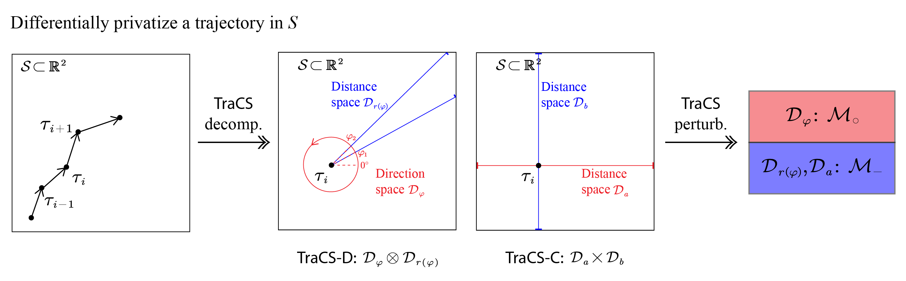

# TraCS

Code for paper: [PETS'26] TraCS: Trajectory Collection in Continuous Space under Local
Differential Privacy

Contributions:
- The first method to collect 2D trajectories in continuous space under pure LDP.
- Demonstrations of the benefits of operating directly in continuous spaces (rather than discretizing).

<div align="center">
  
</div>

## Reproductions

This project was developed with Python 3.13 and uses `uv` for package management. Ensure you have `uv` installed.

**Python packages:** To install the required dependencies (in `pyproject.toml`), cd to the root directory and run:
```bash
uv sync
```
This will create a virtual environment and install all the necessary Python packages with Python version specified in `.python-version` (3.12 in this case).

To reproduce the results in the paper, you can change the directory to `experiments/continuous_space` or
`experiments/discrete_space` and run the corresponding script.
For example, running
```bash
uv run experiment_1_1.py
```
will print the results of the first experiment in the paper.
The `csv` files containing the results will be saved in the `results/` directory, 
where also contains the drawing scripts for the figures in the paper.

## Code Structure

The code is organized as follows:
- `src/` contains the source code for the TraCS mechanisms and other methods.
    - `src/ldp_mechanisms.py` contains the LDP mechanisms used in this paper.
    - `src/perturbation_tracs.py` contains the implementation of TraCS-D and TraCS-C for each location.
    - `src/methods.py` wraps the TraCS methods and other methods for a trajectory.
    - `src/utilities.py` contains some utility functions.
- `tests/` contains the testing code for main classes and methods.
- `experiments/` contains the code for the experiments in the paper.

In file `src/ldp_mechanisms.py`, we classify the LDP mechanisms into `PiecewiseMechanism` and `DiscreteMechanism` classes.
Class `PiecewiseMechanism` encapsulates the piecewise-based mechanisms for the circular domain and the linear domain,
and each perturbation mechanism is implemented as a method of the class. e.g.
```python
perturbed_direction = PiecewiseMechanism(private_val, epsilon).circular_perturbation()
```
instantiates a `PiecewiseMechanism` object with the circular domain and perturbs the private value `private_val` with the given `epsilon`.

**Location-level API.** In `src/perturbation_tracs.py`, TraCS-D and TraCS-C are implemented as the classes `DirectionDistancePerturbation` and `CoordinatePerturbation`, respectively.
To instantiate a TraCS-D object, use:
```python
tracs_d = DirectionDistancePerturbation(ref_location, location, epsilon, epsilon_d, x_max, y_max)
tracs_d_perturbed = tracs_d.perturb()
```
Here, `ref_location` and `location` denote the reference location and the location to be perturbed, respectively.
`epsilon` is the total privacy budget, while `epsilon_d` is the portion of the budget allocated to the direction.
`x_max` and `y_max` specify the bounds of the spatial domain (see Algorithm 1 in the paper).

Implementation tested corrected; see directory `tests/` for the testing code.

**Trajectory-level API.** In file `src/methods.py`, we wrap the TraCS methods and other methods for a trajectory as functions. 
For example, to perturb a trajectory with TraCS-D, we can use
```python
perturbed_traj_tracs_d = tracs_d(private_traj, epsilon, epsilon_d, x_max, y_max)
```
where `private_traj` is the trajectory to be perturbed, and the other parameters are the same as those for the location-level API.

## Freedom of Usage

This project is licensed under the MIT License for freedom of usage and distribution.
Hope this paper and code can help you in your research or work.
