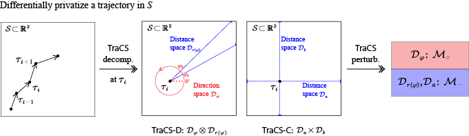

# TraCS

[](https://github.com/ZhengYeah/TraCS/actions/workflows/python-package-conda.yml)

[**Click here for slides.**](others/tracs_slides.pdf)

Code for paper: TraCS: Trajectory Collection in Continuous Space under Local
Differential Privacy

Contributions:
- The first method to collect trajectories in continuous space under pure LDP.
- New perturbation mechanisms for continuous direction space and distance space.

<div align="center">
  
</div>

## Reproductions

To reproduce the results in the paper, you can change the directory to `experiments/continuous_space` or
`experiments/discrete_space` and run the corresponding script.
For example, running
```bash
python experiment_1_1.py
```
will print the results of the first experiment in the paper.
The `csv` files containing the results will be saved in the `results/` directory, 
where also contains the drawing scripts for the figures in the paper. 


## Code Structure

The code is organized as follows:
- `src/` contains the source code for the TraCS mechanisms and other methods.
    - `src/ldp_mechanisms.py` contains the LDP mechanisms used in this paper.
    - `src/perturbation_tracs.py` contains the implementation of TraCS-D and TraCS-C for each location.
    - `src/methods.py` wraps the TraCS methods and other methods for a trajectory.
    - `src/utilities.py` contains some utility functions.
- `tests/` contains the testing code for main classes and methods.
- `experiments/` contains the code for the experiments in the paper.

In file `src/ldp_mechanisms.py`, we classify the LDP mechanisms into `PiecewiseMechanism` and `DiscreteMechanism` classes.
Class `PiecewiseMechanism` encapsulates the piecewise-based mechanisms for the circular domain and the linear domain,
and each perturbation mechanism is implemented as a method of the class. e.g.
```python
perturbed_direction = PiecewiseMechanism(private_val, epsilon).circular_perturbation()
```
instantiates a `PiecewiseMechanism` object with the circular domain and perturbs the private value `private_val` with the given `epsilon`.

In file `src/perturbation_tracs.py`, the
TraCS-D and TraCS-C are encapsulated as classes `DirectionDistancePerturbation` and `CoordinatePerturbation`.
To instantiate a TraCS-D object, we use
```python
tracs_d = DirectionDistancePerturbation(ref_location, location, epsilon, epsilon_d, x_max, y_max)
tracs_d_perturbed = tracs_d.perturb()
```
where `ref_location` and `location` are the reference location and the location to be perturbed, respectively.
`epsilon` and `epsilon_d` are the total privacy budgets and the privacy budget for the direction, respectively.
`x_max` and `y_max` are the size of the domain (Algorithm 1 in the paper).

Implementation tested corrected; see directory `tests/` for the testing code.

There may be division by zero warnings or errors in running the code for discrete spaces,
generally due to the random trajectory generator generating wired trajectories.
When this happens, you can run the code again.

## Freedom of Usage

This project is licensed under the MIT License for freedom of usage and distribution.
Hope this paper and code can help you in your research or work.
